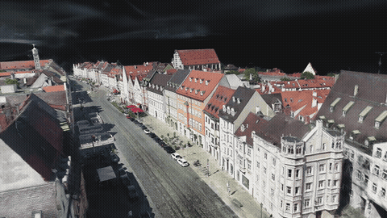
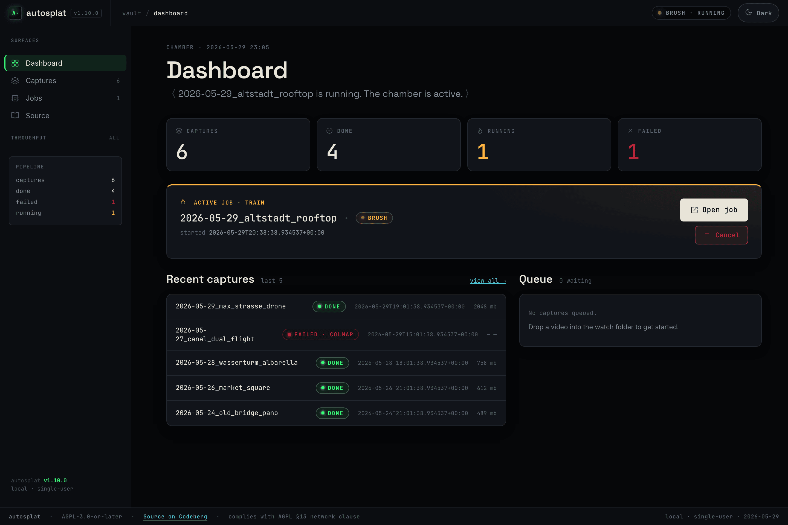

# autosplat

[](https://codeberg.org/jkaindl/autosplat/releases)
[](https://jkaindl.codeberg.page/autosplat/)
[](LICENSE)

**autosplat turns ordinary video into a 3D Gaussian Splat you can fly through in
the browser — captured, reconstructed and rendered entirely on your own machine.
No cloud, no GPU server, no upload.**

<p align="center">
  <a href="https://jkaindl.codeberg.page/autosplat/viewer.html" title="Open the live splat viewer">
    
  </a>
  <br />
  <sub><em>A trained splat flown through in the browser — the <code>max_strasse</code> drone pass,
  reconstructed automatically by the pipeline's auto-bisection rescue (490/493 cameras, 99.4&nbsp;%).<br />
  <strong><a href="https://jkaindl.codeberg.page/autosplat/viewer.html">▶ Try the live viewer</a></strong> ·
  <a href="https://www.youtube.com/watch?v=1U-onh-9QNY">▶ Full fly-through (YouTube)</a> ·
  <a href="pipeline/docs/assets/max_strasse_autobisect_hero.mp4">MP4</a> ·
  <a href="pipeline/docs/assets/max_strasse_autobisect_hero.webm">WebM</a></em></sub>
</p>

## Showcase

<table>
  <tr>
    <td width="33%"></td>
    <td width="33%"></td>
    <td width="33%"></td>
  </tr>
  <tr>
    <td align="center"><sub><em>Herkules — splat in the viewer</em></sub></td>
    <td align="center"><sub><em>Wasserturm — splat in the viewer</em></sub></td>
    <td align="center"><sub><em>Pipeline WebUI — mission control</em></sub></td>
  </tr>
</table>

## Two halves, one repo

autosplat is one product in two parts that share a single file format — the
pipeline **exports** compressed splats, the viewer **loads** them. That contract
is why they live in one repo: cross-cutting changes land in one atomic commit, on
one release line.

| Path | Component | What it is |
|---|---|---|
| [`pipeline/`](pipeline/) | **Capture → splat pipeline** | Drone / handheld video → trained 3D Gaussian Splat. Python · `uv` · COLMAP · Brush (WebGPU). Apple-Silicon-only, macOS 15+. → [`pipeline/README.md`](pipeline/README.md) |
| [`viewer/`](viewer/) | **Splat viewer PWA** | Static, installable web app that loads and renders `.ply` / `.sog` splats locally. Vanilla HTML/CSS/JS, no build step. → [`viewer/README.md`](viewer/README.md) |

```
video ──▶ pipeline/  ──exports .ply / .sog──▶  viewer/  ──▶ fly through it
          (COLMAP → Brush → compress)          (PlayCanvas / WebGL2)
```

## Quickstart

```bash
# Pipeline — Apple Silicon, macOS 15+
cd pipeline
uv run autosplat doctor            # check ffmpeg / colmap / brush
uv run autosplat <your-video>.mp4  # video → trained splat

# Viewer — any modern browser
cd viewer
./serve.sh                         # → http://localhost:8123/
```

The published viewer is live on Codeberg Pages:
**<https://jkaindl.codeberg.page/autosplat/>** — drop in a `.ply`, orbit it, or
**▶ walk through it** in first-person.

Each component documents its own deep setup, CLI, and configuration in its own
README — this page is just the map.

## Develop & test

```bash
cd pipeline && uv run pytest -q     # 448 pipeline unit tests
cd viewer   && ./tests/run.sh       # 77 viewer unit tests (+ opt-in e2e)
```

Publish the viewer to Codeberg Pages (subtree split of `viewer/` → `pages` branch):

```bash
scripts/deploy-pages.sh
```

## Repo layout & versioning

```
autosplat/
├─ README.md · CHANGELOG.md · AGENTS.md      product level (this repo)
├─ LICENSE · LICENSING.md · CLA.md · SECURITY.md · CITATION.cff · CONTRIBUTING.md
├─ scripts/deploy-pages.sh                   viewer → Codeberg Pages
├─ pipeline/                                 capture→splat pipeline (own README/CHANGELOG)
└─ viewer/                                   splat viewer PWA (own README/CHANGELOG)
```

One shared version line starting at **v1.12.0** covers both halves. Pre-merge
history is preserved verbatim — historical tags are namespaced `pipeline-v*` /
`viewer-v*`, and `git log --follow` reaches the full history inside each
subfolder. Per-component release notes:
[`pipeline/CHANGELOG.md`](pipeline/CHANGELOG.md) ·
[`viewer/CHANGELOG.md`](viewer/CHANGELOG.md) · product-level
[`CHANGELOG.md`](CHANGELOG.md).

## License

[AGPL-3.0-or-later](LICENSE), with a dual-licensing / CLA model — see
[`LICENSING.md`](LICENSING.md) and [`CLA.md`](CLA.md). Need terms other than AGPL
(a closed-source product, an App Store build) or a commissioned capture? →
**code@jkaindl.de**.

---

> **Moved here in 2026-06.** Previously two repos — `video-to-3d-gaussian-splat`
> (pipeline) and `autosplat-viewer` (viewer), now archived. This monorepo is the
> canonical home; it is also mirrored to
> [github.com/johannes-kaindl/autosplat](https://github.com/johannes-kaindl/autosplat).
