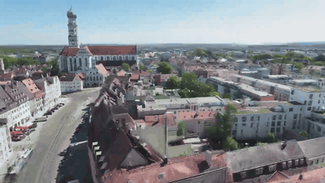
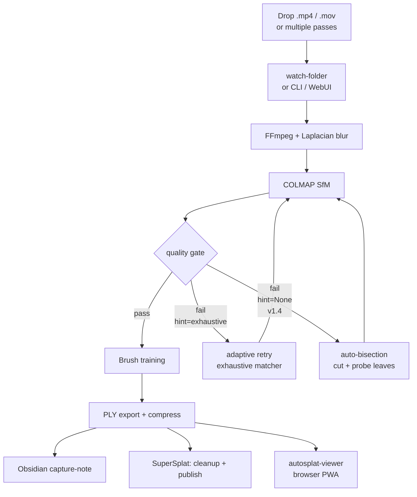

# video-to-3d-gaussian-splat

[](https://www.gnu.org/licenses/agpl-3.0)
[](https://codeberg.org/jkaindl/video-to-3d-gaussian-splat/releases)
[](https://codeberg.org/jkaindl/video-to-3d-gaussian-splat)
[](https://www.python.org/)
[](https://www.apple.com/macos/)
[](https://codeberg.org/jkaindl/video-to-3d-gaussian-splat/src/branch/main/tests)

Automated end-to-end pipeline: video → trained 3D Gaussian Splat, running locally on Apple Silicon.

**Target platform:** Apple Silicon (M5, 32 GB RAM), macOS 15+. Mac-only by design.

> **Status: v1.4.1 — Bisection Polish.** Auto-bisection-rescue with manual `autosplat rescue` command, optional smart-split at motion peaks, per-clip progress in the WebUI, and ~4× faster probes. Mac Silicon, AGPL-3.0.

---

<p align="center">
  <a href="https://www.youtube.com/watch?v=vIXaQPNe_Yk" title="Watch the full 24-second fly-through on YouTube">
    
  </a>
</p>

<p align="center"><strong><a href="https://www.youtube.com/watch?v=vIXaQPNe_Yk">▶ Watch the full 24-second fly-through on YouTube</a></strong></p>

<p align="center"><sub><em>Trained splat fly-through — Augsburg's St. Ulrich und Afra basilica.<br />
Reconstructed from 4 sub-clips of a 5:35 drone pass with 4 turns that v1.2.0 could not solve (<code>max_strasse.MP4</code>).<br />
<code>autosplat process A.mp4 B.mp4 C.mp4 D.mp4</code> → 865/865 cameras → 597k SfM points → 1.8 GB scene.ply.<br />
See <a href="#expected-behavior">Expected Behavior</a> for the full rescue story · <a href="docs/assets/max_strasse_hero.mp4">MP4</a> · <a href="docs/assets/max_strasse_hero.webm">WebM</a></em></sub></p>

---

## About

Video footage — drone, handheld, anything with enough motion parallax — goes in as `.mp4` or `.mov`. A trained 3D Gaussian Splat comes out — ready to open directly in SuperSplat for trimming, camera animation, and publishing.

No cloud. No GPU server. No CUDA stack. Everything runs locally on a Mac with Apple Silicon using WebGPU-native tooling. The pipeline handles preprocessing, Structure-from-Motion via COLMAP, quality gating with adaptive retry, Gaussian Splat training via Brush, compression, Obsidian capture-note generation, and automatic SuperSplat launch.

Real-world validated on 11 captures: **8/11 (73%) trained successfully** in an overnight run on 2026-05-15. v1.2.0 added [resume](#resume-failed-captures) for crash/sleep recovery; v1.3.0 added [multi-video captures](#multi-video-capture) — a rotation-broken pass that previously failed (`max_strasse`, 4 turns) reconstructed at 865/865 cameras after manually splitting into 4 sub-clips. See [Expected Behavior](#expected-behavior) for the honest benchmark.

---

## What it does



The pipeline is **resumable** (sleep / crash / Ctrl-C → `autosplat resume <capture>`), accepts **multiple video passes** for one scene (`autosplat process v1.mp4 v2.mp4 …` or `autosplat add-video <capture> <video>`), and — in v1.4 — escalates a structurally-failing single-video capture to **auto-bisection-rescue**: the source is binary-subdivided, each leaf clip probed with a cheap SfM-only run, and the surviving leaves recombined through the same multi-video path that proved out on `max_strasse`. See [`CAPTURE-GUIDE.md`](docs/CAPTURE-GUIDE.md#auto-bisection-internals-v14) for the on-disk layout and config knobs.

---

## View your splats in the browser

The companion project **[autosplat-viewer](https://codeberg.org/jkaindl/autosplat-viewer)**
is a static PWA that renders Gaussian Splats right in the browser — drop
in a `.ply`, orbit around it, install it as an app. No setup required.

**▶ Try it live: <https://jkaindl.codeberg.page/autosplat-viewer/>**

---

## Release status

For full per-release notes see [`CHANGELOG.md`](https://codeberg.org/jkaindl/video-to-3d-gaussian-splat/src/branch/main/CHANGELOG.md).

| Version  | Date       | Headline                                                                                  |
| -------- | ---------- | ----------------------------------------------------------------------------------------- |
| v1.4.1   | 2026-05-26 | **Bisection Polish** — `autosplat rescue` CLI, opt-in smart-split at motion peak (OpenCV optical flow), WebUI per-clip progress (`bisect · probing clip 0_1`), 4× faster probes, pre-existing mypy noise cleared. |
| v1.4.0   | 2026-05-26 | **Auto-Bisection-Rescue** — when `sequential→exhaustive` exhausts itself, binary-subdivide the source video, probe each leaf clip, and recombine the survivors automatically. `[retry] bisect_*` config knobs. |
| v1.3.0   | 2026-05-24 | **Multi-Video Rescue** — combine N video passes into one capture, `add-video`, `--target-frames`, CAPTURE-GUIDE |
| v1.2.0   | 2026-05-24 | **Resume & Recovery** — `autosplat resume`, adaptive matcher retry, WebUI Resume button, persistent job history |
| v1.1.2   | 2026-05-20 | Hotfix — wall-clock job timestamps + within-day sort, job-status badges, zero ruff findings |
| v1.1.1   | 2026-05-18 | Hotfix — backend status-write sync, SuperSplat URL-loading, vertical scroll, log-box width |
| v1.1.0   | 2026-05-17 | **Kuro Signal Protocol** WebUI restyle — all 7 surfaces, theme toggle, vendored HTMX      |
| v1.0.1   | 2026-05-16 | Docs Sync Patch                                                                            |
| v1.0.0   | 2026-05-16 | **WebUI Release** — FastAPI + HTMX + Jinja2, dashboard, captures, jobs, viewer, AGPL §13 |
| v0.9.0   | earlier    | Initial public release — CLI MVP, watch-folder daemon, quality gate, compress, Obsidian   |

<details>
<summary>Phase status (build phases — collapsed)</summary>

| Phase | Scope                                            | Status                                                                 |
| ----- | ------------------------------------------------ | ---------------------------------------------------------------------- |
| 0     | Manual baseline run                              | ✅ done — first end-to-end run, 107/107 cams, 82 172 Gaussians          |
| 1     | CLI MVP, full one-shot pipeline                  | ✅ done — `autosplat process <video>` end-to-end                        |
| 2     | Watch-folder daemon, persistent queue, recovery  | ✅ done — `autosplat watch <inbox>`, atomic state.json, crash-recovery  |
| 3     | Quality-gate + adaptive retry + history pruning  | ✅ done — gate before Brush, retry with `exhaustive` matcher hint       |
| 4     | Obsidian capture-note auto-generation            | ✅ done — opt-in via `[obsidian].enabled = true`, marker-preserved tail |
| 5     | Compress stage (SOG + SPZ via `splat-transform`) | ✅ done — `autosplat compress`, npx-backend, real ratios (82-91% reduction) |
| 6     | Spec-mandate sweep (preflight, OOM retry, skipped-frames, PLY-min-size) | ✅ done — §9.2 + §5 closed                  |
| 7     | Pipeline-visibility (Brush progress + ETA)       | ✅ done — Rich progress-bar with wall-time-based ETA                    |
| 8     | Obsidian polish (vault-agnostic defaults + frontmatter user-key-preservation) | ✅ done                       |
| 9     | Local SuperSplat auto-open                       | ✅ done — serves PLY over HTTP, auto-opens browser, CORS fix            |
| 9.7   | splat CLI (real executable)                      | ✅ done — `~/.local/bin/splat`, caffeinate-wrap, nohup/tmux-compatible  |
| 10    | WebUI (FastAPI + HTMX + Jinja2) — full browser control | ✅ done — `autosplat webui --port 8080`, dashboard, captures, jobs, viewer, AGPL §13 /source |
| 10.1  | WebUI restyle — Kuro Signal Protocol design system     | ✅ done — all 7 surfaces on KSP tokens, theme toggle, HTMX polling, vendored HTMX, smoke tests |

</details>

---

## Quick start

```bash
# 1. System deps
brew install ffmpeg colmap python@3.11 uv

# 2. Brush binary (Rust, not on Homebrew)
./scripts/fetch_brush.sh

# 3. Python env
uv sync

# 4. Preflight
uv run autosplat doctor

# 5. One-shot run
uv run autosplat process path/to/video.mp4

# 5a. Or combine multiple passes of the same scene (v1.3.0+)
uv run autosplat process pass1.mp4 pass2.mp4 pass3.mp4

# 5b. Resume a crashed/cancelled capture (v1.2.0+)
uv run autosplat resume ~/AutoSplat/captures/2026-05-25_my_scene

# 6. Or watch a folder
uv run autosplat watch ~/AutoSplat/inbox

# 7. Or use the WebUI (full browser control)
uv run autosplat webui --port 8080
# then open http://127.0.0.1:8080
```

See [`docs/WORKFLOWS.md`](https://codeberg.org/jkaindl/video-to-3d-gaussian-splat/src/branch/main/docs/WORKFLOWS.md) for the per-task user guide
and [`docs/CAPTURE-GUIDE.md`](https://codeberg.org/jkaindl/video-to-3d-gaussian-splat/src/branch/main/docs/CAPTURE-GUIDE.md) **before you shoot a video** — most pipeline failures are capture-side, not code-side.

---

## CLI

```
autosplat process <video> [<video2> ...] [--config PATH] [--output-dir PATH]
                          [--skip-stage STAGE] [--target-frames N] [--dry-run]
autosplat resume <capture-dir> [--config PATH] [--target-frames N]   # v1.2.0+
autosplat add-video <capture-dir> <video>                            # v1.3.0+
autosplat watch <folder>  [--config PATH] [--once]
autosplat webui           [--host HOST] [--port PORT] [--reload]
autosplat status                                              # queue + completed + failed tables
autosplat config show | init
autosplat doctor                                              # ffmpeg / colmap / brush / compress
autosplat compress <ply> [--format sog|spz|ksplat]
autosplat version
```

Exit codes: `0` success · `1` user error · `2` pipeline failure · `3` dependency missing.

### Multi-video capture

`autosplat process v1.mp4 v2.mp4 …` combines frames from N videos into one capture. COLMAP solves the combined set — useful when a single pass can't be reconstructed (a 180° turn or 360° spin) but multiple smooth sub-passes can. Each video gets a per-source frame prefix (`<stem>_frame_NNNNN.jpg`) so passes never clobber each other.

`autosplat add-video <capture> <video>` appends another pass to an existing capture and rebuilds frames + SfM + training with the larger set. The WebUI mirrors both flows.

### Resume failed captures

`autosplat resume <capture-dir>` continues a previous capture from on-disk state — no manifest needed. The original video path is scraped from `pipeline.log`. The skip-set is computed by inspecting `frames/`, `colmap/sparse/0/`, `training/*.ply`, `output/scene.ply`. Refuses on a complete capture; delete `output/scene.ply` first or use `autosplat process` for a fresh run. The WebUI exposes the same as a Resume button on every failed capture.

### `--target-frames N`

Per-run override for `preprocess.target_frames` (default `250`). Useful for long videos where the default cap subsamples too aggressively — a 30 min walkthrough otherwise drops to 1 frame every 7 s. Available on both `process` and `resume`.

### WebUI (`autosplat webui`)

```bash
autosplat webui --port 8080                    # start on default port
autosplat webui --host 0.0.0.0 --port 8080     # LAN-accessible (responsive layout incl. mobile/tablet)
```

Opens a FastAPI + HTMX interface at `http://127.0.0.1:8080`. Features:

- **Dashboard** — live capture queue + recent jobs with wall-clock timestamps + within-day sort
- **New capture** form — single video or multi-line (multi-video) input; path-validated
- **Capture detail** — stage timeline, Brush-metrics card, Resume button on failed runs, Add-video form
- **Jobs** — active + recent with per-job status badges (queued/running/done/failed/cancelled)
- **Viewer** — SuperSplat iframe embed for finished splats, three-state fallback
- **`/source`** — AGPL §13 compliance route

Persistent history (`runs.jsonl` append-log) survives WebUI restart. Stale-job liveness reconciliation flips dead worker threads to `failed` instead of phantom `running`. Responsive: 3 breakpoints (Desktop ≥1024 / Tablet ≤1023 / Mobile ≤767), off-canvas sidebar on mobile. **Kuro Signal Protocol** design system (v1.1.0) with dark/light theme toggle (anti-flash, persisted) and HTMX polling on every surface. See [`docs/WORKFLOWS.md`](https://codeberg.org/jkaindl/video-to-3d-gaussian-splat/src/branch/main/docs/WORKFLOWS.md) § "Web-UI control" for the full browser workflow.

---

## Why Brush, not Nerfstudio?

Nerfstudio's `gsplat` rasterization kernels are CUDA-only. Brush is a Rust binary using WebGPU — Mac-native, no CUDA stack required. Spec §2.2 has the full rationale.

---

## Configuration

Defaults live in [`config/default.toml`](https://codeberg.org/jkaindl/video-to-3d-gaussian-splat/src/branch/main/config/default.toml). User overrides:

1. `~/.config/autosplat/config.toml` (XDG-style)
2. `--config <path>` CLI flag

Every key is documented in [`docs/CONFIGURATION.md`](https://codeberg.org/jkaindl/video-to-3d-gaussian-splat/src/branch/main/docs/CONFIGURATION.md).

---

## Test suite

```bash
uv run pytest -q                    # 267 unit tests, ~7s
AUTOSPLAT_E2E=1 uv run pytest      # +1 opt-in end-to-end test (needs ffmpeg+colmap+brush)
AUTOSPLAT_COMPRESS_E2E=1 uv run pytest tests/test_compress.py  # +1 opt-in compress smoke
uv run ruff check src/ tests/      # lint
uv run ruff format src/ tests/     # format
uv run mypy src/                   # type-check (strict mode)
```

Pre-commit hooks run ruff + ruff-format on commit and `pytest` on push. Install once: `pre-commit install`.

---

## Project layout

```
auto-splat-pipeline/
├── src/autosplat/        # 17 modules (+ webui/): config, logging, doctor, preflight,
│                         #   preprocess, sfm, quality, train, export, compress,
│                         #   viewer, watcher, obsidian, notification,
│                         #   pipeline, cli
│   └── webui/            #   FastAPI + HTMX WebUI (app, routes/, jobs_runner, state, templates/, static/)
├── config/default.toml   # All defaults, all sections
├── scripts/              # install_deps.sh, fetch_brush.sh, install_splat.sh, setup_supersplat.sh
├── tests/                # 267 unit + 2 opt-in E2E (see tests/README.md)
├── examples/             # ready-made --config overlays for common use cases
├── docs/                 # spec, architecture, capture-guide, configuration, workflows,
│                         # concepts, getting-started, ply-output-format,
│                         # troubleshooting, phase reports
├── .pre-commit-config.yaml  # pytest + ruff + standard hooks
├── .forgejo/             # Codeberg issue templates (bug_report, feature_request)
├── CHANGELOG.md          # Keep-A-Changelog release notes
├── CITATION.cff          # machine-readable citation metadata
├── SECURITY.md           # security-reporting policy
└── CONTRIBUTING.md       # bug reports, PRs, scope
```

---

## Documentation index

**New here?** Start with [`GETTING-STARTED.md`](https://codeberg.org/jkaindl/video-to-3d-gaussian-splat/src/branch/main/docs/GETTING-STARTED.md).
**About to shoot a video?** Read [`CAPTURE-GUIDE.md`](https://codeberg.org/jkaindl/video-to-3d-gaussian-splat/src/branch/main/docs/CAPTURE-GUIDE.md) first — most pipeline failures are capture-side, not code-side.
**Curious about the moving parts?** Read [`CONCEPTS.md`](https://codeberg.org/jkaindl/video-to-3d-gaussian-splat/src/branch/main/docs/CONCEPTS.md).

### Reference
- [`AUTO-SPLAT PIPELINE — Spec & Implementation Plan.md`](https://codeberg.org/jkaindl/video-to-3d-gaussian-splat/src/branch/main/docs/AUTO-SPLAT%20PIPELINE%20%E2%80%94%20Spec%20%26%20Implementation%20Plan.md) — authoritative spec
- [`ARCHITECTURE.md`](https://codeberg.org/jkaindl/video-to-3d-gaussian-splat/src/branch/main/docs/ARCHITECTURE.md) — module map, capture-dir layout, stage I/O
- [`CAPTURE-GUIDE.md`](https://codeberg.org/jkaindl/video-to-3d-gaussian-splat/src/branch/main/docs/CAPTURE-GUIDE.md) — how to shoot a video COLMAP can actually solve (rotation/texture/lighting rules)
- [`CONFIGURATION.md`](https://codeberg.org/jkaindl/video-to-3d-gaussian-splat/src/branch/main/docs/CONFIGURATION.md) — every TOML key, with example overlays in [`examples/`](https://codeberg.org/jkaindl/video-to-3d-gaussian-splat/src/branch/main/examples)
- [`WORKFLOWS.md`](https://codeberg.org/jkaindl/video-to-3d-gaussian-splat/src/branch/main/docs/WORKFLOWS.md) — user-facing recipes (one-shot, watch, status, viewer, Obsidian, smoke-test)
- [`PLY-OUTPUT-FORMAT.md`](https://codeberg.org/jkaindl/video-to-3d-gaussian-splat/src/branch/main/docs/PLY-OUTPUT-FORMAT.md) — INRIA/Kerbl 3DGS PLY reference + viewer compat matrix + measured compression ratios
- [`TROUBLESHOOTING.md`](https://codeberg.org/jkaindl/video-to-3d-gaussian-splat/src/branch/main/docs/TROUBLESHOOTING.md) — failure-modes + recovery

### Phase notes (release history)
- [`CHANGELOG.md`](https://codeberg.org/jkaindl/video-to-3d-gaussian-splat/src/branch/main/CHANGELOG.md) — per-phase release entries (Keep-A-Changelog format)
- [`PHASE-0-CALIBRATION.md`](https://codeberg.org/jkaindl/video-to-3d-gaussian-splat/src/branch/main/docs/PHASE-0-CALIBRATION.md) — first end-to-end run findings
- [`PHASE-2-WATCHER.md`](https://codeberg.org/jkaindl/video-to-3d-gaussian-splat/src/branch/main/docs/PHASE-2-WATCHER.md) — daemon schema + lifecycle
- [`PHASE-3-RETRY.md`](https://codeberg.org/jkaindl/video-to-3d-gaussian-splat/src/branch/main/docs/PHASE-3-RETRY.md) — quality-gate + adaptive retry
- [`PHASE-9-PLAN.md`](https://codeberg.org/jkaindl/video-to-3d-gaussian-splat/src/branch/main/docs/PHASE-9-PLAN.md) — Local SuperSplat auto-open design
- [`PHASE-9-RECON.md`](https://codeberg.org/jkaindl/video-to-3d-gaussian-splat/src/branch/main/docs/PHASE-9-RECON.md) — Phase-9 recon findings
- [`PHASE-10-WEBUI.md`](https://codeberg.org/jkaindl/video-to-3d-gaussian-splat/src/branch/main/docs/PHASE-10-WEBUI.md) — Phase 10 WebUI plan snapshot (FastAPI + HTMX)

### Tooling
- [`tests/README.md`](https://codeberg.org/jkaindl/video-to-3d-gaussian-splat/src/branch/main/tests/README.md) — how to run unit + opt-in E2E tests
- [`CONTRIBUTING.md`](https://codeberg.org/jkaindl/video-to-3d-gaussian-splat/src/branch/main/CONTRIBUTING.md) — bug reports + PR workflow

---

## Methodology

This pipeline was built phase by phase using a Recon → Plan → Sub-Phase pattern. Each phase starts with a recon document (`docs/PHASE-N-RECON.md`) that maps the problem space, followed by a plan document (`docs/PHASE-N-PLAN.md`) that defines acceptance criteria before any code is written. Phases are tagged in git on completion.

This build methodology is visible in the repository history and docs. It is part of ongoing research into trace-based emergent coordination — the phase documents and commit graph form a machine-readable trace of how the system developed.

---

## Expected Behavior

**Overnight run 2026-05-15 — 11 captures (DJI Neo 2 drone footage), Apple M5 32 GB:**

| Result | Count | Notes |
|--------|-------|-------|
| Trained successfully | 8 | PLY exported, SuperSplat-ready |
| Failed | 3 | See failure classification below |

**Failure classification (deterministic, not silently broken):**
- COLMAP SfM failure — insufficient feature overlap (fast fly-through, heavy motion blur). Pipeline exits with `pipeline.failed` event and structured log. No silent hang.
- Quality-gate rejection after exhaustive retry — low Gaussian count even with relaxed parameters. Pipeline classifies explicitly as `quality_gate.failed`.
- Compress backend unavailable — graceful skip, PLY still exported. Logged as warning, not error.

All failures produce structured JSON events in `state.json` and are visible via `autosplat status`. The 73% success rate is the honest baseline for real-world footage on Apple Silicon without manual SfM parameter tuning.

**v1.2.0+ rescue paths reduce the failure rate further:**
- Crashed / cancelled / host-slept runs → `autosplat resume <capture>` picks up at the highest completed stage.
- Sequential-matcher failures → adaptive retry transparently re-runs with `exhaustive` matcher (a 180° drone turn with 3/244 cameras self-rescued to a successful run).
- Rotation-broken passes (180°/360° turns) → split the source, then `autosplat process clip_a.mp4 clip_b.mp4 …`. The `max_strasse` capture (previously unrecoverable in v1.2.0) reconstructed at **865/865 cameras** with 4 manually-split sub-clips. See [`docs/CAPTURE-GUIDE.md`](https://codeberg.org/jkaindl/video-to-3d-gaussian-splat/src/branch/main/docs/CAPTURE-GUIDE.md) for the shoot rules and recovery decision tree.

---

## Contributing

Issues and pull requests are welcome at [codeberg.org/jkaindl/video-to-3d-gaussian-splat](https://codeberg.org/jkaindl/video-to-3d-gaussian-splat). For larger changes, open an issue first to discuss the approach. See [`CONTRIBUTING.md`](https://codeberg.org/jkaindl/video-to-3d-gaussian-splat/src/branch/main/CONTRIBUTING.md) for bug-report and PR conventions.

---

## Project status

Actively maintained by a single maintainer ([@jkaindl](https://codeberg.org/jkaindl)). Apple-Silicon focus. Pull requests for cross-platform support are welcome but not actively pursued by the maintainer.

---

## License

**Code:** GNU Affero General Public License v3.0 or later (AGPL-3.0-or-later) — see [LICENSE](https://codeberg.org/jkaindl/video-to-3d-gaussian-splat/src/branch/main/LICENSE).

**Documentation** (README, `docs/`): Creative Commons Attribution-ShareAlike 4.0 International (CC BY-SA 4.0) — see [LICENSE-DOCS](https://codeberg.org/jkaindl/video-to-3d-gaussian-splat/src/branch/main/LICENSE-DOCS).

### Why AGPL?

This license choice is not arbitrary. AGPL is the legal mechanism that protects a specific logic: contributions to the commons stay in the commons — even when someone attempts to commercialize them via a network service.

Unlike permissive licenses (MIT, Apache) or file-level copyleft (MPL), AGPL's Network Clause (§13) prevents this code from becoming the foundation of closed, commercially controlled infrastructure. If you run a modified version as a network service, you must make the source available to users of that service.

This is a deliberate choice against maximum adoption and for theoretical coherence: what is published as a contribution to the commons should remain in the commons — even if that limits adoption by actors whose business model depends on re-privatizing commons contributions.

**Dependency licenses:** All Python dependencies (typer, pydantic, numpy, opencv-python, rich, structlog, watchdog, etc.) are MIT/BSD/Apache-2.0 — AGPL-3.0-compatible. External tool invocations (COLMAP BSD-3, FFmpeg LGPL, Brush Apache-2.0, SuperSplat MIT) are via subprocess aggregation, conforming with FSF GPL FAQ aggregation rules.

---

Copyright (C) 2026 Johannes Kaindl. Licensed under AGPL-3.0-or-later (code) and CC BY-SA 4.0 (docs).
