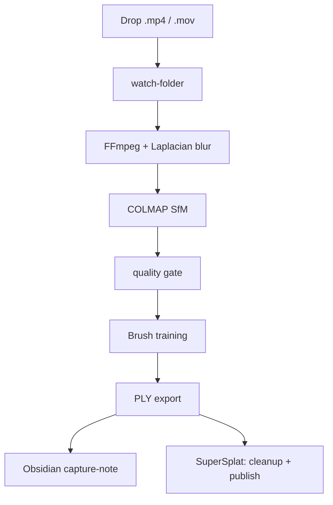

# video-to-3d-gaussian-splat

[](https://www.gnu.org/licenses/agpl-3.0)
[](https://codeberg.org/jkaindl/video-to-3d-gaussian-splat/releases)
[](https://codeberg.org/jkaindl/video-to-3d-gaussian-splat)

Automated end-to-end pipeline: video → trained 3D Gaussian Splat, running locally on Apple Silicon.

**Target platform:** Apple Silicon (M5, 32 GB RAM), macOS 15+. Mac-only by design.

> **Status: v1.1.2 — WebUI Restyle + Hotfix.** Mac Silicon, AGPL-3.0.

---

## About

Video footage — drone, handheld, anything with enough motion parallax — goes in as `.mp4` or `.mov`. A trained 3D Gaussian Splat comes out — ready to open directly in SuperSplat for trimming, camera animation, and publishing.

No cloud. No GPU server. No CUDA stack. Everything runs locally on a Mac with Apple Silicon using WebGPU-native tooling. The pipeline handles preprocessing, Structure-from-Motion via COLMAP, quality gating with adaptive retry, Gaussian Splat training via Brush, compression, Obsidian capture-note generation, and automatic SuperSplat launch.

Real-world validated on 11 captures: **8/11 (73%) trained successfully** in an overnight run on 2026-05-15. See [Expected Behavior](#expected-behavior) for the honest benchmark.

---

## What it does



---

## View your splats in the browser

The companion project **[autosplat-viewer](https://codeberg.org/jkaindl/autosplat-viewer)**
is a static PWA that renders Gaussian Splats right in the browser — drop
in a `.ply`, orbit around it, install it as an app. No setup required.

**▶ Try it live: <https://jkaindl.codeberg.page/autosplat-viewer/>**

---

## Phase status

| Phase | Scope                                            | Status                                                                 |
| ----- | ------------------------------------------------ | ---------------------------------------------------------------------- |
| 0     | Manual baseline run                              | ✅ done — first end-to-end run, 107/107 cams, 82 172 Gaussians          |
| 1     | CLI MVP, full one-shot pipeline                  | ✅ done — `autosplat process <video>` end-to-end                        |
| 2     | Watch-folder daemon, persistent queue, recovery  | ✅ done — `autosplat watch <inbox>`, atomic state.json, crash-recovery  |
| 3     | Quality-gate + adaptive retry + history pruning  | ✅ done — gate before Brush, retry with `exhaustive` matcher hint       |
| 4     | Obsidian capture-note auto-generation            | ✅ done — opt-in via `[obsidian].enabled = true`, marker-preserved tail |
| 5     | Compress stage (SOG + SPZ via `splat-transform`) | ✅ done — `autosplat compress`, npx-backend, real ratios (82-91% reduction) |
| 6     | Spec-mandate sweep (preflight, OOM retry, skipped-frames, PLY-min-size) | ✅ done — §9.2 + §5 closed                  |
| 7     | Pipeline-visibility (Brush progress + ETA)       | ✅ done — Rich progress-bar with wall-time-based ETA                    |
| 8     | Obsidian polish (vault-agnostic defaults + frontmatter user-key-preservation) | ✅ done                       |
| 9     | Local SuperSplat auto-open                       | ✅ done — serves PLY over HTTP, auto-opens browser, CORS fix            |
| 9.7   | splat CLI (real executable)                      | ✅ done — `~/.local/bin/splat`, caffeinate-wrap, nohup/tmux-compatible  |
| 10    | WebUI (FastAPI + HTMX + Jinja2) — full browser control | ✅ done — `autosplat webui --port 8080`, dashboard, captures, jobs, viewer, AGPL §13 /source |
| 10.1  | WebUI restyle — Kuro Signal Protocol design system     | ✅ done — all 7 surfaces on KSP tokens, theme toggle, HTMX polling, vendored HTMX, smoke tests |

---

## Quick start

```bash
# 1. System deps
brew install ffmpeg colmap python@3.11 uv

# 2. Brush binary (Rust, not on Homebrew)
./scripts/fetch_brush.sh

# 3. Python env
uv sync

# 4. Preflight
uv run autosplat doctor

# 5. One-shot run
uv run autosplat process path/to/video.mp4

# 6. Or watch a folder
uv run autosplat watch ~/AutoSplat/inbox

# 7. Or use the WebUI (full browser control)
uv run autosplat webui --port 8080
# then open http://127.0.0.1:8080
```

See [`docs/WORKFLOWS.md`](https://codeberg.org/jkaindl/video-to-3d-gaussian-splat/src/branch/main/docs/WORKFLOWS.md) for the per-task user guide.

---

## CLI

```
autosplat process <video> [--config PATH] [--output-dir PATH] [--skip-stage STAGE] [--dry-run]
autosplat watch <folder>  [--config PATH] [--once]
autosplat webui           [--host HOST] [--port PORT] [--reload]   # WebUI (Phase 10)
autosplat status                                              # queue + completed + failed tables
autosplat config show | init
autosplat doctor                                              # ffmpeg / colmap / brush / compress
autosplat compress <ply> [--format sog|spz|ksplat]
autosplat version
```

Exit codes: `0` success · `1` user error · `2` pipeline failure · `3` dependency missing.

### WebUI (`autosplat webui`)

```bash
autosplat webui --port 8080        # start on default port
autosplat webui --host 0.0.0.0 --port 8080   # LAN-accessible
```

Opens a FastAPI + HTMX interface at `http://127.0.0.1:8080`. Features: live capture queue + dashboard, per-capture stage timeline, process/cancel/retry buttons, SuperSplat iframe embed for finished splats, AGPL §13 `/source` route. The interface uses the **Kuro Signal Protocol** design system (v1.1.0) with a dark/light theme toggle (anti-flash, persisted in `localStorage`) and live HTMX polling on every surface. See [`docs/WORKFLOWS.md`](https://codeberg.org/jkaindl/video-to-3d-gaussian-splat/src/branch/main/docs/WORKFLOWS.md) § "Web-UI control" for the full browser workflow.

---

## Why Brush, not Nerfstudio?

Nerfstudio's `gsplat` rasterization kernels are CUDA-only. Brush is a Rust binary using WebGPU — Mac-native, no CUDA stack required. Spec §2.2 has the full rationale.

---

## Configuration

Defaults live in [`config/default.toml`](https://codeberg.org/jkaindl/video-to-3d-gaussian-splat/src/branch/main/config/default.toml). User overrides:

1. `~/.config/autosplat/config.toml` (XDG-style)
2. `--config <path>` CLI flag

Every key is documented in [`docs/CONFIGURATION.md`](https://codeberg.org/jkaindl/video-to-3d-gaussian-splat/src/branch/main/docs/CONFIGURATION.md).

---

## Test suite

```bash
uv run pytest -q                    # 200 unit tests, ~7s
AUTOSPLAT_E2E=1 uv run pytest      # +1 opt-in end-to-end test (needs ffmpeg+colmap+brush)
AUTOSPLAT_COMPRESS_E2E=1 uv run pytest tests/test_compress.py  # +1 opt-in compress smoke
uv run ruff check src/ tests/      # lint
```

---

## Project layout

```
auto-splat-pipeline/
├── src/autosplat/        # 16 modules (+ webui/): config, logging, doctor, preflight,
│                         #   preprocess, sfm, quality, train, export,
│                         #   viewer, watcher, obsidian, compress,
│                         #   pipeline, cli
│   └── webui/            #   FastAPI + HTMX WebUI (Phase 10)
├── config/default.toml   # All defaults, all sections
├── scripts/              # install_deps.sh, fetch_brush.sh, install_splat.sh
├── tests/                # 200 unit + 2 opt-in E2E (see tests/README.md)
├── examples/             # ready-made --config overlays for common use cases
├── docs/                 # spec, architecture, configuration, workflows,
│                         # concepts, getting-started, ply-output-format,
│                         # troubleshooting, phase reports
├── .pre-commit-config.yaml  # pytest + ruff + standard hooks
├── CHANGELOG.md          # per-phase release notes
└── CONTRIBUTING.md       # bug reports, PRs, scope
```

---

## Documentation index

**New here?** Start with [`GETTING-STARTED.md`](https://codeberg.org/jkaindl/video-to-3d-gaussian-splat/src/branch/main/docs/GETTING-STARTED.md).
**Curious about the moving parts?** Read [`CONCEPTS.md`](https://codeberg.org/jkaindl/video-to-3d-gaussian-splat/src/branch/main/docs/CONCEPTS.md).

### Reference
- [`AUTO-SPLAT PIPELINE — Spec & Implementation Plan.md`](https://codeberg.org/jkaindl/video-to-3d-gaussian-splat/src/branch/main/docs/AUTO-SPLAT%20PIPELINE%20%E2%80%94%20Spec%20%26%20Implementation%20Plan.md) — authoritative spec
- [`ARCHITECTURE.md`](https://codeberg.org/jkaindl/video-to-3d-gaussian-splat/src/branch/main/docs/ARCHITECTURE.md) — module map, capture-dir layout, stage I/O
- [`CONFIGURATION.md`](https://codeberg.org/jkaindl/video-to-3d-gaussian-splat/src/branch/main/docs/CONFIGURATION.md) — every TOML key, with example overlays in [`examples/`](https://codeberg.org/jkaindl/video-to-3d-gaussian-splat/src/branch/main/examples)
- [`WORKFLOWS.md`](https://codeberg.org/jkaindl/video-to-3d-gaussian-splat/src/branch/main/docs/WORKFLOWS.md) — user-facing recipes (one-shot, watch, status, viewer, Obsidian, smoke-test)
- [`PLY-OUTPUT-FORMAT.md`](https://codeberg.org/jkaindl/video-to-3d-gaussian-splat/src/branch/main/docs/PLY-OUTPUT-FORMAT.md) — INRIA/Kerbl 3DGS PLY reference + viewer compat matrix + measured compression ratios
- [`TROUBLESHOOTING.md`](https://codeberg.org/jkaindl/video-to-3d-gaussian-splat/src/branch/main/docs/TROUBLESHOOTING.md) — failure-modes + recovery

### Phase notes (release history)
- [`CHANGELOG.md`](https://codeberg.org/jkaindl/video-to-3d-gaussian-splat/src/branch/main/CHANGELOG.md) — per-phase release entries (Keep-A-Changelog format)
- [`PHASE-0-CALIBRATION.md`](https://codeberg.org/jkaindl/video-to-3d-gaussian-splat/src/branch/main/docs/PHASE-0-CALIBRATION.md) — first end-to-end run findings
- [`PHASE-2-WATCHER.md`](https://codeberg.org/jkaindl/video-to-3d-gaussian-splat/src/branch/main/docs/PHASE-2-WATCHER.md) — daemon schema + lifecycle
- [`PHASE-3-RETRY.md`](https://codeberg.org/jkaindl/video-to-3d-gaussian-splat/src/branch/main/docs/PHASE-3-RETRY.md) — quality-gate + adaptive retry
- [`PHASE-9-PLAN.md`](https://codeberg.org/jkaindl/video-to-3d-gaussian-splat/src/branch/main/docs/PHASE-9-PLAN.md) — Local SuperSplat auto-open design
- [`PHASE-9-RECON.md`](https://codeberg.org/jkaindl/video-to-3d-gaussian-splat/src/branch/main/docs/PHASE-9-RECON.md) — Phase-9 recon findings
- [`PHASE-10-WEBUI.md`](https://codeberg.org/jkaindl/video-to-3d-gaussian-splat/src/branch/main/docs/PHASE-10-WEBUI.md) — Phase 10 WebUI plan snapshot (FastAPI + HTMX)

### Tooling
- [`tests/README.md`](https://codeberg.org/jkaindl/video-to-3d-gaussian-splat/src/branch/main/tests/README.md) — how to run unit + opt-in E2E tests
- [`CONTRIBUTING.md`](https://codeberg.org/jkaindl/video-to-3d-gaussian-splat/src/branch/main/CONTRIBUTING.md) — bug reports + PR workflow

---

## Methodology

This pipeline was built phase by phase using a Recon → Plan → Sub-Phase pattern. Each phase starts with a recon document (`docs/PHASE-N-RECON.md`) that maps the problem space, followed by a plan document (`docs/PHASE-N-PLAN.md`) that defines acceptance criteria before any code is written. Phases are tagged in git on completion.

This build methodology is visible in the repository history and docs. It is part of ongoing research into trace-based emergent coordination — the phase documents and commit graph form a machine-readable trace of how the system developed.

---

## Expected Behavior

**Overnight run 2026-05-15 — 11 captures (DJI Neo 2 drone footage), Apple M5 32 GB:**

| Result | Count | Notes |
|--------|-------|-------|
| Trained successfully | 8 | PLY exported, SuperSplat-ready |
| Failed | 3 | See failure classification below |

**Failure classification (deterministic, not silently broken):**
- COLMAP SfM failure — insufficient feature overlap (fast fly-through, heavy motion blur). Pipeline exits with `pipeline.failed` event and structured log. No silent hang.
- Quality-gate rejection after exhaustive retry — low Gaussian count even with relaxed parameters. Pipeline classifies explicitly as `quality_gate.failed`.
- Compress backend unavailable — graceful skip, PLY still exported. Logged as warning, not error.

All failures produce structured JSON events in `state.json` and are visible via `autosplat status`. The 73% success rate is the honest baseline for real-world footage on Apple Silicon without manual SfM parameter tuning.

---

## Contributing

Issues and pull requests are welcome at [codeberg.org/jkaindl/video-to-3d-gaussian-splat](https://codeberg.org/jkaindl/video-to-3d-gaussian-splat). For larger changes, open an issue first to discuss the approach. See [`CONTRIBUTING.md`](https://codeberg.org/jkaindl/video-to-3d-gaussian-splat/src/branch/main/CONTRIBUTING.md) for bug-report and PR conventions.

---

## Project status

Actively maintained by a single maintainer ([@jkaindl](https://codeberg.org/jkaindl)). Apple-Silicon focus. Pull requests for cross-platform support are welcome but not actively pursued by the maintainer.

---

## License

**Code:** GNU Affero General Public License v3.0 or later (AGPL-3.0-or-later) — see [LICENSE](https://codeberg.org/jkaindl/video-to-3d-gaussian-splat/src/branch/main/LICENSE).

**Documentation** (README, `docs/`): Creative Commons Attribution-ShareAlike 4.0 International (CC BY-SA 4.0) — see [LICENSE-DOCS](https://codeberg.org/jkaindl/video-to-3d-gaussian-splat/src/branch/main/LICENSE-DOCS).

### Why AGPL?

This license choice is not arbitrary. AGPL is the legal mechanism that protects a specific logic: contributions to the commons stay in the commons — even when someone attempts to commercialize them via a network service.

Unlike permissive licenses (MIT, Apache) or file-level copyleft (MPL), AGPL's Network Clause (§13) prevents this code from becoming the foundation of closed, commercially controlled infrastructure. If you run a modified version as a network service, you must make the source available to users of that service.

This is a deliberate choice against maximum adoption and for theoretical coherence: what is published as a contribution to the commons should remain in the commons — even if that limits adoption by actors whose business model depends on re-privatizing commons contributions.

**Dependency licenses:** All Python dependencies (typer, pydantic, numpy, opencv-python, rich, structlog, watchdog, etc.) are MIT/BSD/Apache-2.0 — AGPL-3.0-compatible. External tool invocations (COLMAP BSD-3, FFmpeg LGPL, Brush Apache-2.0, SuperSplat MIT) are via subprocess aggregation, conforming with FSF GPL FAQ aggregation rules.

---

Copyright (C) 2026 Johannes Kaindl. Licensed under AGPL-3.0-or-later (code) and CC BY-SA 4.0 (docs).
