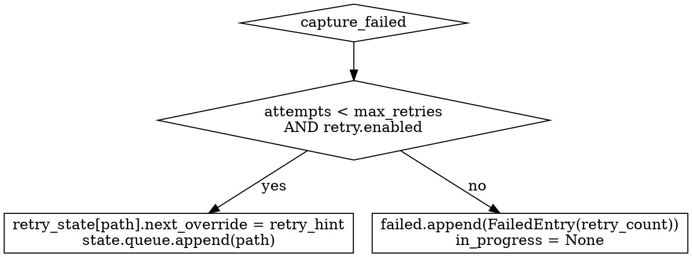

# Phase 3 — Quality-Validation & Adaptive Retry

Spec §11.3: `Bei schlechtem Footage → graceful retry → skip` and
`Validation-Failures landen mit Begründung in State-File`.

Built on top of the Phase-2 watcher. Three coordinated features:

1. **Quality-Gate** — a stage between SfM and Brush that bails out *before* the expensive 25-30 min Brush run when COLMAP output is too thin to produce a usable splat.
2. **Adaptive Retry** — when the quality-gate fails, the watcher re-enqueues the capture with a config override (e.g. `colmap.matcher: sequential → exhaustive`). The same retry path covers crashes (`recover_state` re-enqueues `interrupted` captures).
3. **History Pruning** — `completed` and `failed` lists are trimmed FIFO so `state.json` stays bounded over weeks of operation.

## Quality-Gate

After `sfm.done`, `pipeline.run_pipeline` calls `quality.check_sfm_quality`. Two thresholds (both configurable):

| Threshold              | Default | Means                                                  |
| ---------------------- | ------: | ------------------------------------------------------ |
| `min_camera_ratio`     |  `0.5`  | `cameras_registered / frames_kept`                     |
| `min_points`           |  `5000` | absolute COLMAP sparse-point count                     |

Defaults derived from the Phase-0 calibration (docs/PHASE-0-CALIBRATION.md):
- bench_chill: ratio = 1.0 (107/107), 53 222 points → ✅ pass
- ice_bird sequential: ratio = 0.04 (4/106), 642 points → ❌ fail (both)
- ice_bird exhaustive: ratio = 0.02 (2/106), 2 863 points → ❌ fail

When the gate fails, it raises `QualityGateFailure(reason, stage, retry_hint, metrics)`:

| Reason                | Retry hint                                       |
| --------------------- | ------------------------------------------------ |
| `low_camera_ratio` + matcher was sequential | `{"colmap": {"matcher": "exhaustive"}}` |
| `low_camera_ratio` + matcher already exhaustive | `None` (no further matcher swap)         |
| `low_points`          | `None` (texture-poor scenes need recapture, not pipeline tuning) |

Disable per run with `[quality_gate].enabled = false` if you want Brush to attempt training regardless.

## Adaptive Retry

`WatcherState` gains two fields:

```python
class FailedEntry:
    ... + retry_count: int = 0          # attempts before final-fail

class RetryRecord:
    attempts: int                        # attempts already made
    last_reason: str | None
    next_override: dict | None           # cfg-override for next pop_next

class WatcherState:
    ... + retry_state: dict[str, RetryRecord]
```

### Decision flow on a failure



`reconcile_failure` is the single entry-point. The worker calls it with the exception's `reason` and `retry_hint`; for non-quality failures the `retry_hint` is `None`, so the policy collapses to "retry up to max_retries times, then give up".

### Crash-recovery through the same retry path

`recover_state(state, retry_cfg)` now consults `retry_state[path].attempts` for the orphan `in_progress` entry:

- `attempts < max_retries` → re-enqueue, log `watcher.recovered action=re_enqueued`
- `attempts ≥ max_retries` → final-fail with `reason="interrupted_max_retries"`
- `retry.enabled = false` → final-fail with `reason="interrupted"` (matches Phase-2 behaviour)

The first time a retry exhausts (or the user disables retries), the `failed` list captures the exact attempt count under `retry_count`.

### Override application

`config.apply_override(cfg, override)` deep-merges the override dict into the Pydantic config and re-validates. The watcher hands the override to `process_fn(path, *, config_override=...)`; `pipeline.run_pipeline` accepts the same kwarg and applies it before any stage runs.

This means **every** capture in the retry path can have its own per-attempt config — not just the matcher swap. Future Phase-4+ retry policies (e.g. halve `brush.resolution_cap` on Brush OOM, per spec §9.2) can be added by extending `quality._retry_hint_for` and the per-failure decision in `reconcile_failure`.

## History Pruning

`mark_done` and `mark_failed` accept `max_history` (defaults to `cfg.status.max_history = 50`). When the list exceeds the cap, the oldest entry is dropped (FIFO). On a successful completion, the path's entry in `retry_state` is wiped — keeps the dict from growing forever.

## state.json schema (Phase 3)

```json
{
  "queue": ["/inbox/v3.mp4"],
  "in_progress": {
    "path": "/inbox/v2.mp4",
    "started_at": "2026-05-14T13:42:00Z",
    "stage": "training"
  },
  "completed": [
    {"path": "/inbox/v1.mp4", "output_ply": "/outputs/v1/scene.ply", "duration_s": 435.6, "finished_at": "..."}
  ],
  "failed": [
    {"path": "/inbox/bad.mov", "failed_at": "...", "reason": "low_camera_ratio: 0.04 < 0.5 (after 3 attempts)", "stage": "sfm_validation", "retry_count": 3}
  ],
  "retry_state": {
    "/inbox/in_flight.mp4": {
      "attempts": 1,
      "last_reason": "low_camera_ratio: 0.04 < 0.5",
      "next_override": {"colmap": {"matcher": "exhaustive"}}
    }
  }
}
```

The loader is tolerant of pre-Phase-3 state.json (no `retry_state` field, no `retry_count` on FailedEntry).

## CLI surface

No new commands. Existing surface picks the new behaviour up automatically:

```bash
$ autosplat watch ~/inbox
Recovered 1 in-progress entry from previous run.
Watching: /inbox (Ctrl-C to stop)
Processing: /inbox/flaky.mp4
… [quality-gate fails] …
Processing (retry, override={'colmap': {'matcher': 'exhaustive'}}): /inbox/flaky.mp4
… [exhaustive matcher → success] …

$ autosplat status
                Recent completed
┏━━━━━━━━━━━━━━━━━━━┳━━━━━━━━━━━━━━━━━━━━━┳━━━━━━━━━━━┳━━━━━━━━━━━━━━━━━━━━━━┓
┃ Video             ┃ Output              ┃ Duration  ┃ Finished             ┃
┡━━━━━━━━━━━━━━━━━━━╇━━━━━━━━━━━━━━━━━━━━━╇━━━━━━━━━━━╇━━━━━━━━━━━━━━━━━━━━━━┩
│ /inbox/flaky.mp4  │ /outputs/.../scene.ply │ 435.6s │ 2026-05-14T13:55:00Z │
└───────────────────┴─────────────────────┴───────────┴──────────────────────┘
```

## Acceptance against spec §11.3

| Criterion                                                                  | Status                                       |
| -------------------------------------------------------------------------- | -------------------------------------------- |
| Bei schlechtem Footage → graceful retry → skip                            | ✅ `test_daemon_retries_quality_gate_failure` + `test_daemon_final_fails_after_max_retries` |
| Validation-Failures landen mit Begründung in State-File                    | ✅ `mark_failed` writes `reason` + `retry_count`; verified by `test_reconcile_failure_*` and the smoke run |

Plus the §5 Phase-3 implicit items:
- Per-stage validation (cameras enough) — ✅ quality_gate
- Adaptive retry mit veränderten Parametern — ✅ apply_override + retry_hint
- Skipped-Frames-Detection in FFmpeg — _deferred_ (preprocess already logs blur-rejected count; full detection of ffmpeg's "skipped frames" warning is a small follow-up)
- Pre-flight checks (video duration / resolution / fps plausibel) — _deferred_ (would live in `doctor.py` or a new `preflight.py`)

## Out of scope (Phase 4+)

- **Brush OOM retry with halved `resolution_cap`** — spec §9.2 lists this; the plumbing is here, just need a `BrushOOMError` and a corresponding retry-hint policy.
- **Skipped-frames-detection from FFmpeg stderr** — not yet wired in the preprocess module.
- **Pre-flight checks per video** (duration, resolution, fps sanity) — would gate the SfM stage too, not just Brush.
